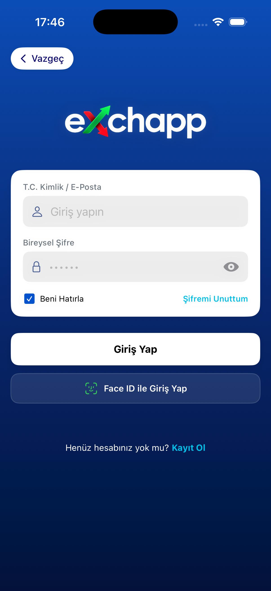
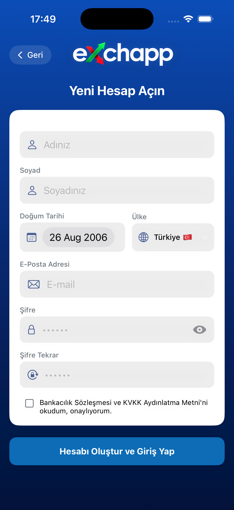
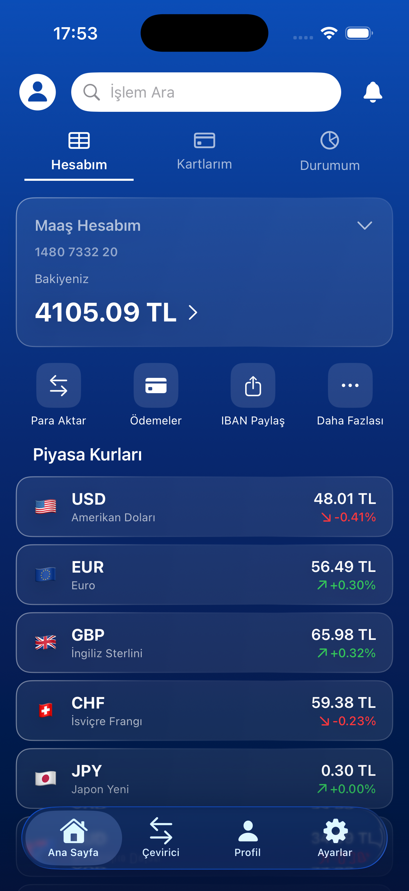
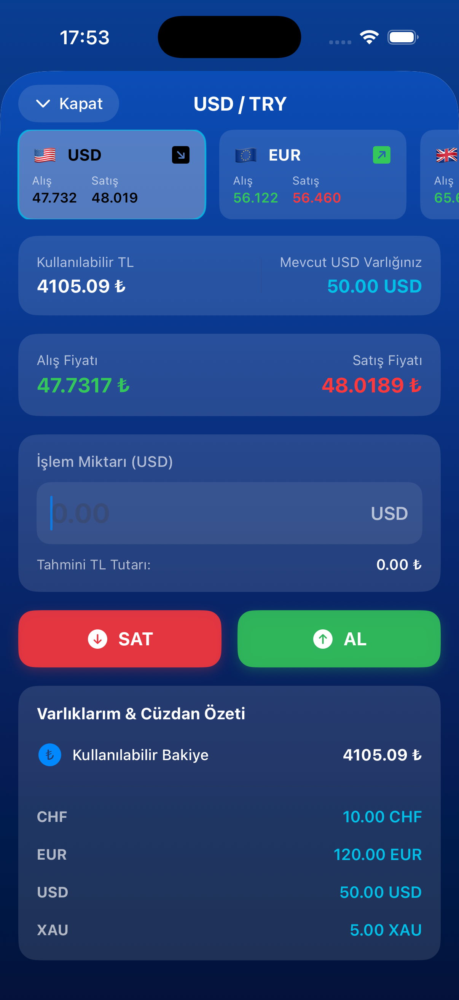
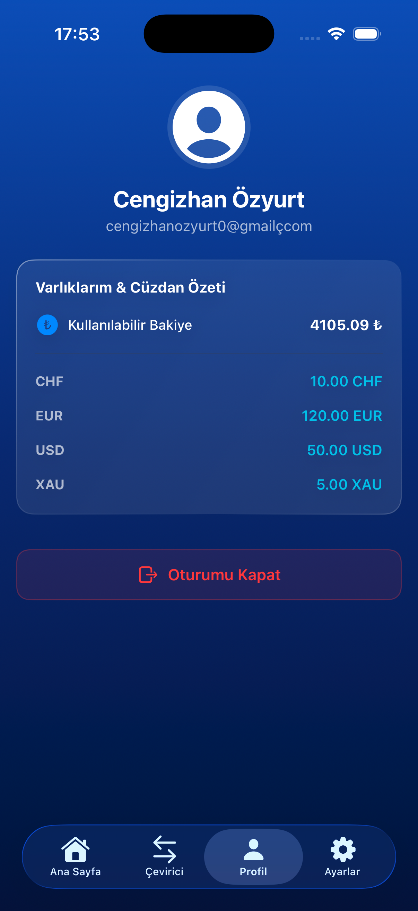

# eXchapp — Modern iOS Exchange & Banking Simulator


[](https://opensource.org/licenses/MIT)

---

## Table of Contents

- [Description](#-short-description)
- [Screenshots](#-screenshots)
- [Key Features](#-key-features)
- [Technical Highlights & Architecture](#-technical-highlights--architecture)
- [Getting Started / Installation](#-getting-started--installation)
- [Folder Structure](#-folder-structure)
- [Contact & License](#-contact--license)

---

## Short Description

**eXchapp** is a production-grade, SwiftUI-native iOS application that simulates a modern foreign exchange and digital banking platform. Users can **securely register and authenticate** (password or Face ID), monitor **live-simulated currency rates** in real-time, execute **buy/sell trades**, and manage a **persistent local portfolio wallet** — all backed by a robust offline-first SQLite database and a reactive MVVM architecture powered by Combine.

> Built as a showcase of advanced iOS engineering practices, eXchapp demonstrates secure state management, C-level database safety, custom gesture-driven animations, and Apple-first cryptography primitives.

---

## Screenshots

| Login / Face ID Auth | Registration |
|:---:|:---:|
|  |  |
| *Secure biometric & password authentication* | *Onboarding with strict validation* |

| Dashboard / Home | Trade Detail (Live Marquee Ticker) |
|:---:|:---:|
|  |  |
| *Live rate cards & quick actions* | *Auto-scrolling ticker with touch-to-pause* |

| Profile / Portfolio Wallet | Currency Calculator |
|:---:|:---:|
|  |  |
| *Holdings summary, balance, & session management* | *Quick & accurate currency conversions* |

---

## Key Features

### Secure Authentication
- **Password-based login** with strict numeric-only input (`.numberPad`) and client-side filtering
- **Face ID biometric authentication** via `LocalAuthentication` framework with graceful device-capability fallbacks
- **New user registration** with pre-seeded starting balance (₺17,500 default)

### Live Currency Rates
- **Real-time simulated market ticker** — rates update every 5 seconds with stochastic ±0.45% fluctuation
- **Multi-currency support** — USD, EUR, GBP, CHF, JPY, AUD, SEK, NOK, SAR, plus precious metals (XAU/XAG, gram-converted)
- **Buy/Sell spread calculation** (0.3% differential) for realistic market-maker simulation
- **Percentage change indicators** with up/down trend arrows and color-coded direction

### Trading Engine
- **One-tap BUY / SELL** execution with instant balance and holdings reconciliation
- **Real-time cost estimation** — input a quantity and see the ₺ equivalent update live
- **Portfolio-aware validation** — prevents insufficient-balance trades and negative-position sell attempts
- **Cross-currency conversion utility** — TRY-to-FX, FX-to-TRY, and FX-to-FX triangular paths

### Local Portfolio Wallet
- **Persistent holdings tracking** — every currency's balance is stored per-user
- **Available balance card** with formatted ₺ display
- **Sorted holdings list** showing non-zero positions only
- **Automatic state propagation** — after every trade, balance + holdings are persisted *and* reflected in-memory instantly

---

## Technical Highlights & Architecture

### 1. MVVM Architecture with SwiftUI
eXchapp follows a strict **Model-View-ViewModel** separation, ensuring unidirectional data flow and maximum testability.

- **Models** — Pure value types (`struct Currency`, `struct UserSession`) with zero side-effects. See [CurrencyModel.swift](file:///Users/kawhi2ceng/Desktop/softtech/eXchapp/eXchapp/Models/CurrencyModel.swift) and [AuthManager.swift](file:///Users/kawhi2ceng/Desktop/softtech/eXchapp/eXchapp/Models/AuthManager.swift).
- **ViewModels** — `@MainActor`-isolated `ObservableObject` classes that own business logic, expose `@Published` state, and mediate between Models and Services. See [CurrencyViewModel.swift](file:///Users/kawhi2ceng/Desktop/softtech/eXchapp/eXchapp/ViewModels/CurrencyViewModel.swift), [AuthViewModel.swift](file:///Users/kawhi2ceng/Desktop/softtech/eXchapp/eXchapp/ViewModels/AuthViewModel.swift), and [TradeDetailViewModel.swift](file:///Users/kawhi2ceng/Desktop/softtech/eXchapp/eXchapp/ViewModels/TradeDetailViewModel.swift).
- **Views** — 100% declarative SwiftUI with `@ObservedObject` / `@StateObject` bindings, custom theming, and no direct database access. See [LoginView.swift](file:///Users/kawhi2ceng/Desktop/softtech/eXchapp/eXchapp/Presentation/Views/LoginView.swift), [TradeDetailView.swift](file:///Users/kawhi2ceng/Desktop/softtech/eXchapp/eXchapp/Presentation/Views/TradeDetailView.swift), [ProfileView.swift](file:///Users/kawhi2ceng/Desktop/softtech/eXchapp/eXchapp/Presentation/Views/ProfileView.swift).

### 2. Reactive Programming with Combine
The entire currency pipeline and UI refresh cycle is **Combine-driven**:

- **Live-rate simulation**: `Timer.publish` → `Task`-wrapped mutation of the `@Published currencies` array every 5 seconds.
- **View-level reactivity**: `onReceive(autoScrollPublisher)` in the marquee ticker subscribes to a 1.5s `Timer.publish(every:on:in:)` stream that auto-advances the scroll offset.
- **Thread safety**: All ViewModels are annotated `@MainActor`, eliminating race conditions on UI-bound state.

### 3. Offline-First SQLite3 Database (C-Level Safe Binding)
eXchapp ships with a **raw SQLite3 C API** persistence layer — no ORM wrappers, no SwiftData, no CoreData. This approach is deliberate:

- **Parameterized queries via `sqlite3_bind_*`** — *every* user-supplied value (email, name, password hash, amounts) is bound to a prepared statement using `sqlite3_bind_text`, `sqlite3_bind_int`, or `sqlite3_bind_double`. **Zero string interpolation in SQL → zero SQL injection surface.** See [DatabaseManager.swift](file:///Users/kawhi2ceng/Desktop/softtech/eXchapp/eXchapp/Services/DatabaseManager.swift#L98-L135).

  ```swift
  sqlite3_bind_text(stmt, 1, (userId as NSString).utf8String, -1, nil)
  sqlite3_bind_double(stmt, 7, initialBalance)
  sqlite3_bind_int(stmt, 5, Int32(age))
  ```

- **Schema**: Four relational tables — `UserProfile`, `LatestExchangeRates`, `HistoricalExchangeRates`, `UserHoldings` (composite PK on `mail + currencyCode`).
- **Singleton lifetime**: `DatabaseManager.shared` opens the DB on `init`, runs `CREATE TABLE IF NOT EXISTS` migrations, and closes on `deinit`.
- **Regional decimal safety**: Storing currency values as `REAL` (IEEE-754 double) inside SQLite, not locale-formatted strings, avoids comma/dot separator bugs across Turkish (`1.234,56`) and English (`1,234.56`) locales.

### 4. Single Source of Truth: Centralized `UserSession`
Global authentication state is owned by the `@MainActor AuthManager` singleton:

```swift
public struct UserSession {
    public let name: String
    public let surname: String
    public let mail: String
    public let balance: Double
    public let holdings: [String: Double]
}
```

- `AuthManager.shared.currentUser` is the **only** in-memory source for the active session.
- `@Published var isLoggedIn: Bool` drives conditional UI (e.g., ProfileView swaps between login-prompt and authenticated states).
- On successful DB write (trade, update), the ViewModel updates *both* the DB row *and* refreshes the session struct, keeping storage and memory consistent by construction. See [AuthManager.swift](file:///Users/kawhi2ceng/Desktop/softtech/eXchapp/eXchapp/Models/AuthManager.swift#L11-L44).

### 5. Advanced UI/UX — The Marquee Ticker

The horizontal currency strip in [TradeDetailView.swift](file:///Users/kawhi2ceng/Desktop/softtech/eXchapp/eXchapp/Presentation/Views/TradeDetailView.swift#L90-L150) is a custom implementation with three noteworthy behaviors:

1. **Triple-buffered infinite scroll** — The data array is concatenated 3× (`baseCurrencies + baseCurrencies + baseCurrencies`). When the scroll index reaches `2 * originalCount`, the `ScrollViewReader` silently rewinds to `originalCount`, giving the illusion of a continuous loop without visible snap-back.

2. **Timer-driven auto-scroll** — `autoScrollPublisher` fires every 1.5s and advances `autoScrollIndex` via `proxy.scrollTo(...)` with an ease-in-out curve of 0.8s, producing a smooth cinematic motion.

3. **Touch-to-pause using `simultaneousGesture`** — A `DragGesture` is attached via `.simultaneousGesture` (not the exclusive `.gesture`) so the native horizontal ScrollView behavior is preserved. On `onChanged` → `isUserInteracting = true` (pause the timer consumer). On `onEnded` → a 3-second grace-period Task fires before resuming auto-scroll, preventing jitter from quick flicks.

### 6. High-Security Posture

- **Password hashing via CryptoKit SHA-256** — Cleartext passwords never touch the database. Before any write or read, the input string is hashed through `CryptoKit.SHA256` and stored as a 64-character hex digest. Identical logic is used in both [LoginView.swift](file:///Users/kawhi2ceng/Desktop/softtech/eXchapp/eXchapp/Presentation/Views/LoginView.swift#L292-L296) and [AuthViewModel.swift](file:///Users/kawhi2ceng/Desktop/softtech/eXchapp/eXchapp/ViewModels/AuthViewModel.swift#L65-L69):

  ```swift
  private func sha256(_ input: String) -> String {
      let inputData = Data(input.utf8)
      let hashedData = SHA256.hash(data: inputData)
      return hashedData.compactMap { String(format: "%02x", $0) }.joined()
  }
  ```

- **Strict numeric input enforcement** — The password field uses `.keyboardType(.numberPad)` *and* an `.onChange` filter that strips any non-digit character, even if the user finds a way to paste from clipboard.
- **Biometric gated login** — Face ID is attempted via `LAContext.evaluatePolicy(.deviceOwnerAuthenticationWithBiometrics)` only when a prior successful password login has saved an email + opt-in flag to `UserDefaults`. No biometric data ever leaves the device's Secure Enclave.

---

## Getting Started / Installation

### Prerequisites

| Tool | Minimum Version |
|------|:---------------:|
| macOS | Monterey 12.5+ |
| Xcode | 15.0 |
| iOS SDK | 17.0 |
| Swift | 5.9 |
| iPhone Simulator / Device | iOS 15.0+ |

### Steps

```bash
# 1. Clone the repository
git clone https://github.com/yourusername/eXchapp.git
cd eXchapp

# 2. Open the project in Xcode
open eXchapp.xcodeproj

# 3. Select a simulator or connected device
(Xcode → Product → Destination → Pick any iPhone, iOS 15+)

# 4. Build and run
Press ⌘R, or click the Play button in the Xcode toolbar
```

> **Note**: The SQLite database file is created at first launch inside the app's `Documents` directory as `SofttechBank_v3.sqlite`. No external network or backend is required — the entire app runs fully offline with simulated live rates.

---

## Folder Structure

```
eXchapp/
├── eXchapp/
│   ├── App/                            # App entry-point & lifecycle
│   │   ├── AppDelegate.swift           # UIApplicationDelegate (global setup)
│   │   ├── SceneDelegate.swift         # UIScene lifecycle & root navigation
│   │   └── FeatureFlags.swift          # Runtime feature toggles
│   │
│   ├── Models/                         # Pure value types & session state
│   │   ├── AuthManager.swift           # UserSession struct + AuthManager (SSOT)
│   │   └── CurrencyModel.swift         # Currency struct + CurrencyResponse (Codable)
│   │
│   ├── ViewModels/                     # MVVM Presenters — business logic + Combine
│   │   ├── AuthViewModel.swift         # register(), login(), sha256()
│   │   ├── CurrencyViewModel.swift     # Live rate simulation, convert(), refresh()
│   │   └── TradeDetailViewModel.swift  # Buy/sell execution, holdings reconciliation
│   │
│   ├── Presentation/
│   │   ├── Controllers/                # UIKit container controllers
│   │   │   ├── RootTabBarController.swift
│   │   │   └── HomeViewController.swift
│   │   │
│   │   └── Views/                      # SwiftUI screens
│   │       ├── SplashView.swift
│   │       ├── LoginView.swift         # Password + Face ID auth
│   │       ├── RegisterView.swift
│   │       ├── HomeView.swift          # Dashboard / rate cards
│   │       ├── TradeDetailView.swift   # Marquee ticker + buy/sell
│   │       ├── ConvertView.swift
│   │       ├── ProfileView.swift       # Portfolio wallet
│   │       └── SettingsView.swift
│   │
│   ├── Services/                       # Infrastructure & I/O
│   │   ├── DatabaseManager.swift       # Raw SQLite3 C-API (sqlite3_bind_*)
│   │   └── NetworkManager.swift        # Async/Await exchange API client
│   │
│   ├── Utilities/
│   │   ├── AppTheme.swift              # Color palette, backgrounds, card modifiers
│   │   └── LiquidGlassModifier.swift   # Custom frosted-glass effect
│   │
│   └── Resources/
│       ├── Assets.xcassets/            # AppIcon, logos, color sets
│       └── Base.lproj/LaunchScreen.storyboard
│
├── eXchapp.xcodeproj/                  # Xcode project metadata
├── eXchappTests/                       # Unit tests (XCTest)
├── eXchappUITests/                     # XCUITest UI automation
└── .gitignore
```

---

## Contact & License

### Author
**Cengizhan Özyurt** — Senior iOS Engineer
- GitHub: [@yourusername](https://github.com/yourusername)
- Email: your.email@example.com
- LinkedIn: [linkedin.com/in/yourprofile](https://linkedin.com/in/yourprofile)

### License
```
MIT License

Copyright (c) 2026 Cengizhan Özyurt

Permission is hereby granted, free of charge, to any person obtaining a copy
of this software and associated documentation files (the "Software"), to deal
in the Software without restriction, including without limitation the rights
to use, copy, modify, merge, publish, distribute, sublicense, and/or sell
copies of the Software, and to permit persons to whom the Software is
furnished to do so, subject to the following conditions:

The above copyright notice and this permission notice shall be included in all
copies or substantial portions of the Software.

THE SOFTWARE IS PROVIDED "AS IS", WITHOUT WARRANTY OF ANY KIND, EXPRESS OR
IMPLIED, INCLUDING BUT NOT LIMITED TO THE WARRANTIES OF MERCHANTABILITY,
FITNESS FOR A PARTICULAR PURPOSE AND NONINFRINGEMENT. IN NO EVENT SHALL THE
AUTHORS OR COPYRIGHT HOLDERS BE LIABLE FOR ANY CLAIM, DAMAGES OR OTHER
LIABILITY, WHETHER IN AN ACTION OF CONTRACT, TORT OR OTHERWISE, ARISING FROM,
OUT OF OR IN CONNECTION WITH THE SOFTWARE OR THE USE OR OTHER DEALINGS IN THE
SOFTWARE.
```

---

<p align="center">
  <sub>Built with using SwiftUI · Combine · SQLite3 · CryptoKit</sub>
  <br>
  <sub><strong>eXchapp</strong> — Exchange, anywhere, anytime.</sub>
</p>
